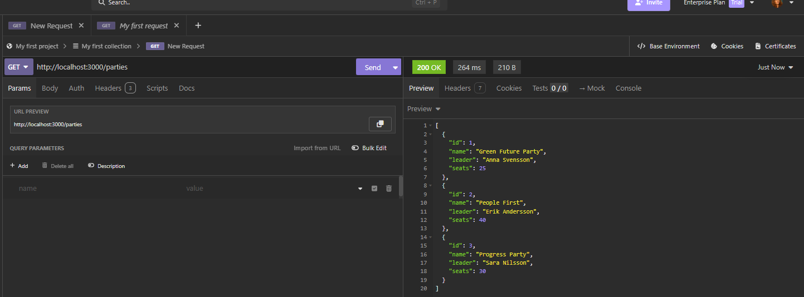
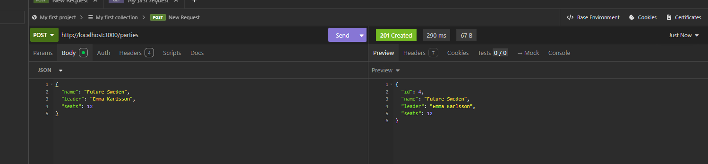
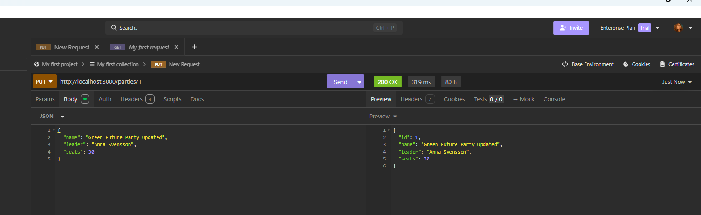
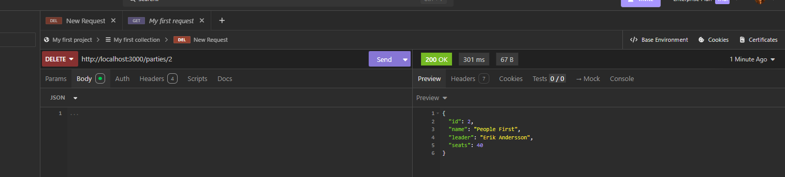
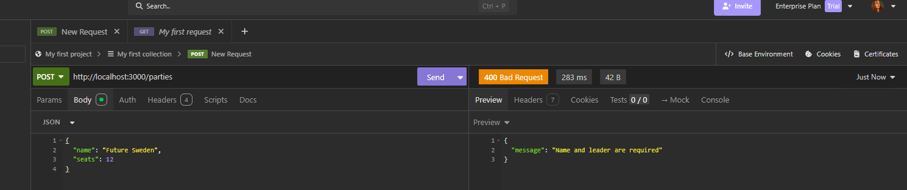

# Week 5 - Express CRUD

In this assignment I practiced CRUD with Express.

I created routes to:
- get all parties
- add a new party
- update a party
- delete a party
- handle bad input

I tested everything in Insomnia.

## Testing

### GET parties

### POST party

### PUT party

### DELETE party

### Bad request
