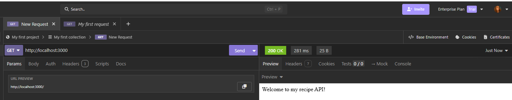
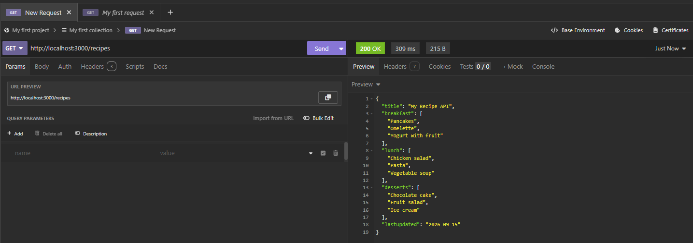
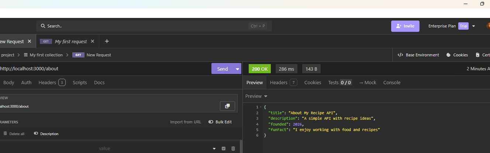
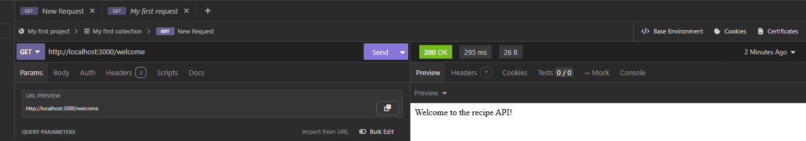
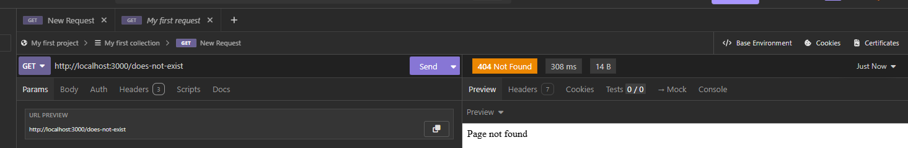

# Week 5 - HTTP and Express

This assignment is about learning the basics of HTTP and Express.

## What I did

- Created an Express server
- Added a homepage route
- Added a `/recipes` route with JSON data
- Tested the routes with Insomnia
- Added an `/about` route
- Added a `/welcome` route using `res.send()`
- Added a 404 response for routes that do not exist

I practiced using `app.get()`, `res.send()`, `res.json()` and status codes.

## Insomnia testing

### Homepage

### Recipes

### About

### Welcome

### 404 Not Found
