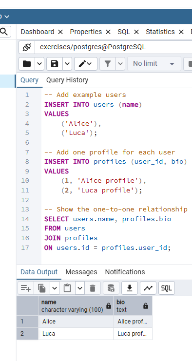
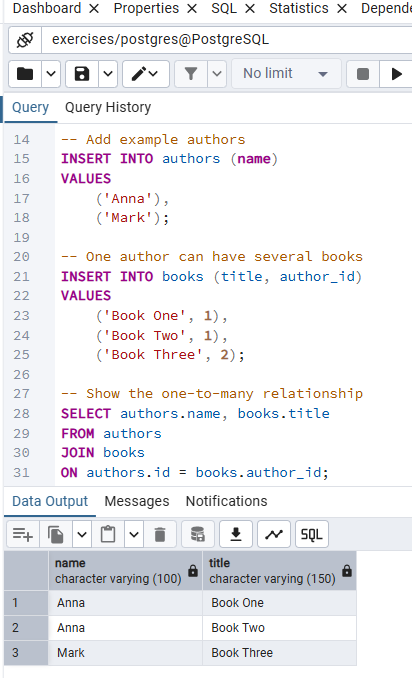
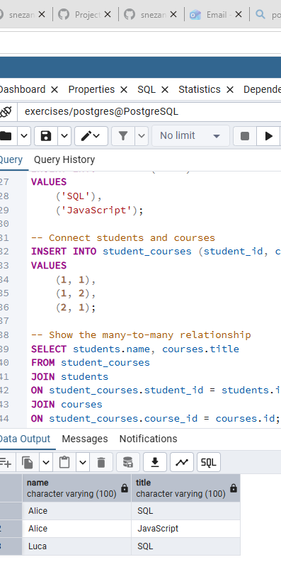
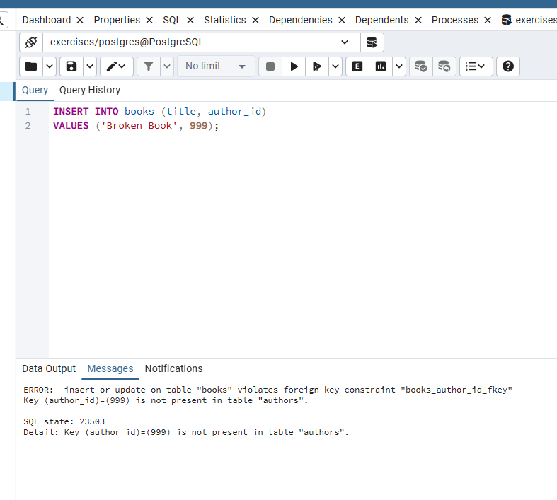
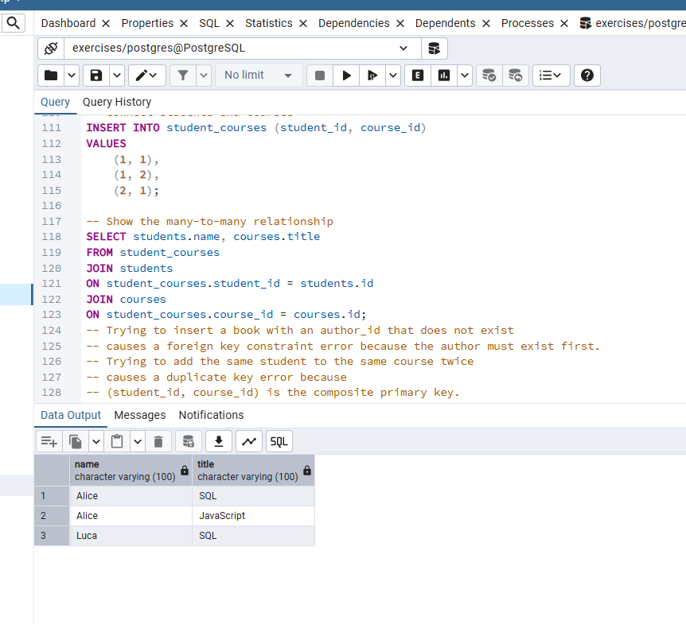
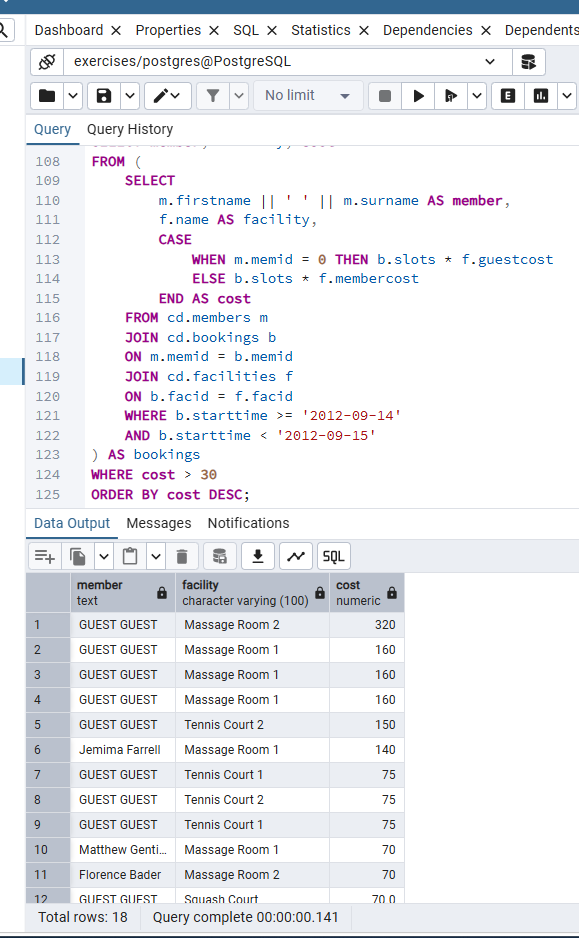

# Week 7 – SQL Relationships, JOINs & Subqueries

This project is part of my backend studies at Sundsgården.

The goal of this assignment was to practice SQL relationships, foreign keys, JOINs, self-joins, subqueries and relationship constraints using PostgreSQL and pgAdmin.

## Technologies

- PostgreSQL
- pgAdmin 4
- Docker
- Docker Compose
- SQL
- Git & GitHub

## Project Structure

```text
week-2-sundgarden/
│
├── docs/
│   └── sqljoins-screenshots/
│       ├── 14-one-to-one-result.png
│       ├── 15-one-to-many-result.png
│       ├── 16-many-to-many-result.png
│       ├── 17-foreign-key-error.png
│       ├── 29-relationships-full-test.png
│       └── 30-joins-full-test.png
│
├── .gitignore
├── compose.yml
├── joins.sql
├── relationships.sql
└── README.md
```

## Docker Setup

The project uses Docker Compose with:

- PostgreSQL
- pgAdmin 4

Start the containers with:

```bash
docker compose up -d
```

pgAdmin is available locally at:

```text
http://localhost:8080
```

## Skill 1 – SQL Relationships

The `relationships.sql` file demonstrates three common database relationships.

### One-to-One

A user can have one profile.



### One-to-Many

One author can have several books.



### Many-to-Many

Students and courses use a junction table called `student_courses`.

A student can attend several courses and one course can contain several students.



## Relationship Constraints

Foreign keys were tested by intentionally trying to insert invalid data.

For example, inserting a book with an `author_id` that does not exist causes a foreign key constraint error.



The many-to-many table also uses a composite primary key:

```sql
PRIMARY KEY (student_id, course_id)
```

This prevents the same student/course combination from being inserted twice.

## Skill 2 – Country Club Relationships

The Country Club database contains relationships between:

- `cd.members`
- `cd.facilities`
- `cd.bookings`

The `cd.bookings` table connects members and facilities using:

```text
memid
facid
```

This creates a many-to-many relationship between members and facilities.

The `recommendedby` column in `cd.members` creates a self-referencing relationship where one member can recommend another member.

## Skill 3 – JOINs & Subqueries

The `joins.sql` file contains exercises using:

- `INNER JOIN`
- `LEFT JOIN`
- self-joins
- three-table joins
- `DISTINCT`
- `CASE`
- subqueries
- ordering and filtering
- calculated booking costs

Examples include:

- retrieving booking times for a member
- finding tennis court bookings
- finding members who recommended other members
- showing members with their recommender
- finding members who used tennis courts
- calculating costly bookings
- solving queries with subqueries instead of joins

## Final Tests

The complete `relationships.sql` file was tested from top to bottom successfully.



The complete `joins.sql` file was also tested from top to bottom successfully.



## Git Branch

This assignment was completed on:

```text
week7/sqljoins
```

## Author

**Snezana Kragujevac**

Backend Development Student  
Sundsgården Folkhögskola