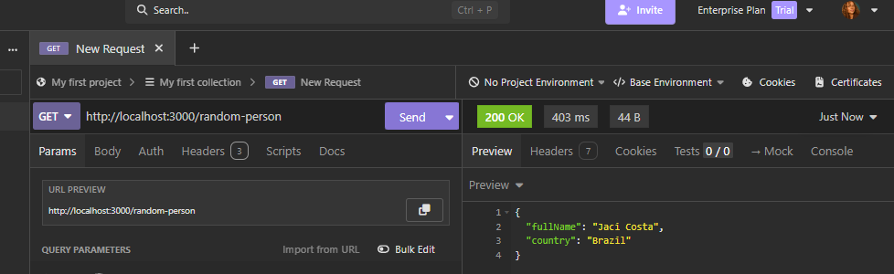
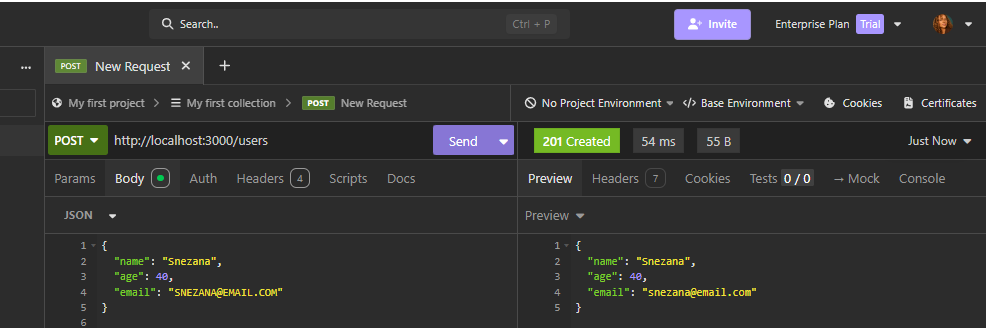
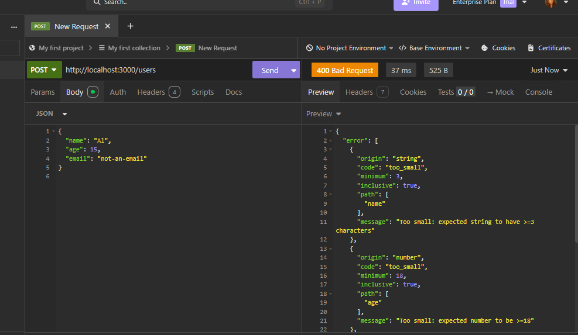
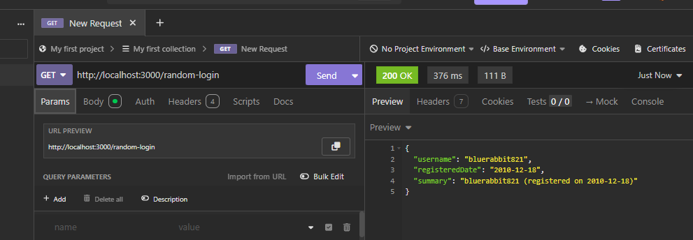
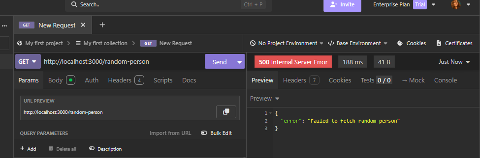

# Random Person API Homework

A small Express and TypeScript API using the Random User API and Zod validation.

## Features

- `GET /ping`
- `GET /random-person`
- `POST /users`
- `GET /random-login` - optional challenge
- Zod validation
- Error handling with status codes `200`, `201`, `400` and `500`

## Install

```bash
npm install
```

## Start the server

```bash
npx tsx server/server.ts
```

The server runs on:

```text
http://localhost:3000
```

## Testing

The API was tested in Insomnia.

### GET /ping - 200 OK


### GET /random-person - 200 OK



### POST /users - 201 Created



### POST /users - 400 Bad Request



### GET /random-login - 200 OK



### GET /random-person - 500 Internal Server Error

