# Week 7 – SQL Basics

This project is part of my backend studies at Sundsgården.

The goal of this assignment was to practice PostgreSQL, pgAdmin, Docker Compose, and basic SQL queries using the Country Club database from [pgexercises.com](https://pgexercises.com/).

## Technologies

- PostgreSQL
- pgAdmin 4
- Docker
- Docker Compose
- SQL
- Git & GitHub

## Project Structure

```text
week-2-sundgarden/
│
├── docs/
│   └── screenshots/
├── .gitignore
├── cd.sql
├── compose.yml
└── README.md
```

The `.env` file contains the local database credentials and is excluded from Git using `.gitignore`.

## Docker Setup

The project uses Docker Compose to run two services:

- PostgreSQL database
- pgAdmin 4

Both services use persistent Docker volumes.

Start the containers with:

```bash
docker compose up -d
```

Check that they are running with:

```bash
docker container ls
```

pgAdmin is available locally at:

```text
http://localhost:8080
```

## Database

The Country Club database from pgexercises.com was imported into PostgreSQL.

Database:

```text
exercises
```

Schema:

```text
cd
```

The imported data was verified with:

```sql
SELECT * FROM cd.facilities;
```

### Facilities Data

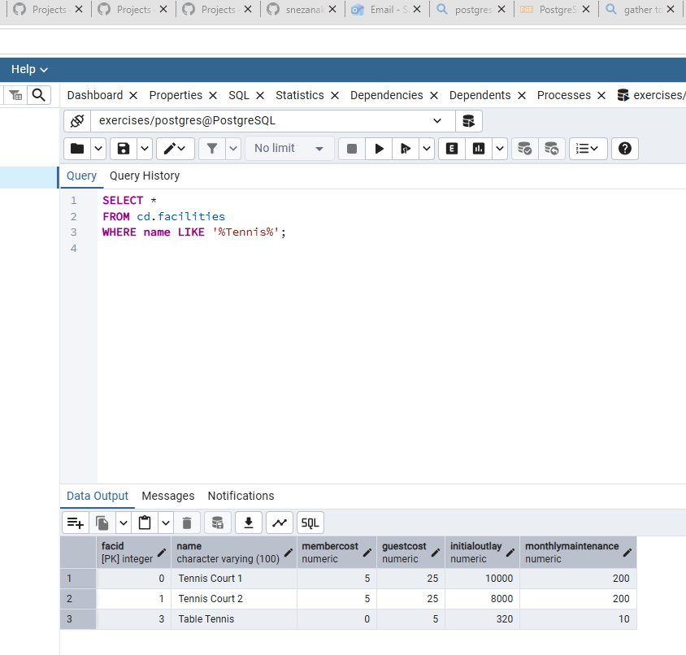

## SQL Exercises

The `cd.sql` file contains all 12 exercises from the Basic section of pgexercises.com.

### 1. Retrieve everything from a table

```sql
SELECT * FROM cd.facilities;
```

### 2. Retrieve specific columns

```sql
SELECT name, membercost
FROM cd.facilities;
```

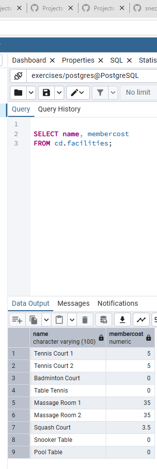

### 3. Control which rows are retrieved

```sql
SELECT *
FROM cd.facilities
WHERE membercost > 0;
```

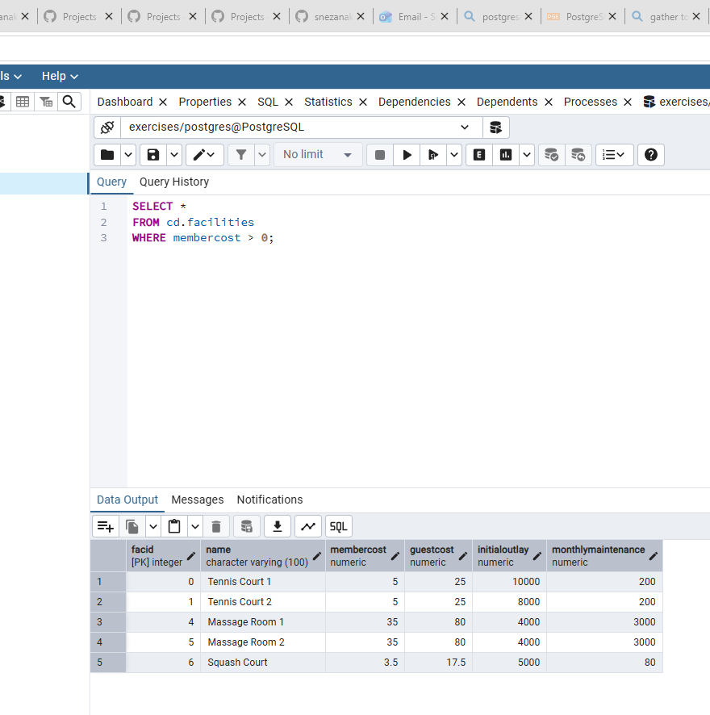

### 4. Control which rows are retrieved – part 2

```sql
SELECT facid, name, membercost, monthlymaintenance
FROM cd.facilities
WHERE membercost > 0
AND membercost < monthlymaintenance / 50.0;
```

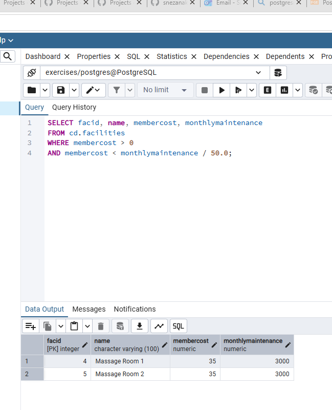

### 5. Basic string searches

```sql
SELECT *
FROM cd.facilities
WHERE name LIKE '%Tennis%';
```

### 6. Matching against multiple possible values

```sql
SELECT *
FROM cd.facilities
WHERE facid IN (1, 5);
```

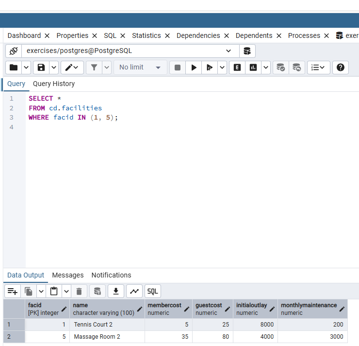

### 7. Classify results into buckets

```sql
SELECT name,
       CASE
           WHEN monthlymaintenance > 100 THEN 'expensive'
           ELSE 'cheap'
       END AS cost
FROM cd.facilities;
```

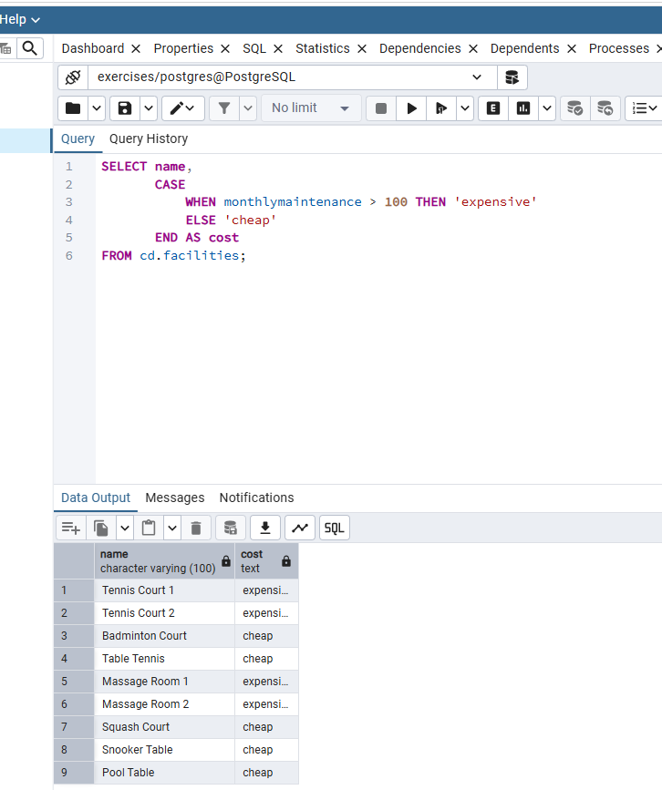

### 8. Working with dates

```sql
SELECT memid, surname, firstname, joindate
FROM cd.members
WHERE joindate >= '2012-09-01';
```

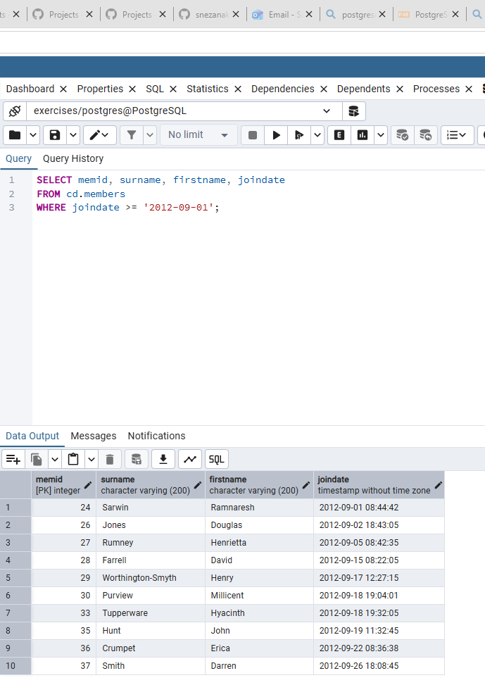

### 9. Removing duplicates and ordering results

```sql
SELECT DISTINCT surname
FROM cd.members
ORDER BY surname
LIMIT 10;
```

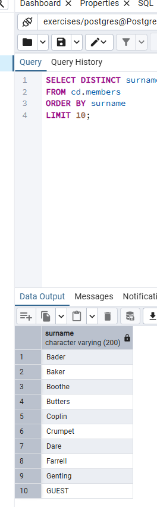

### 10. Combining results from multiple queries

```sql
SELECT surname
FROM cd.members

UNION

SELECT name
FROM cd.facilities;
```

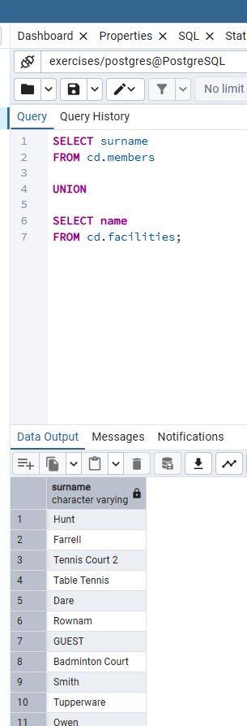

### 11. Simple aggregation

```sql
SELECT MAX(joindate) AS latest
FROM cd.members;
```

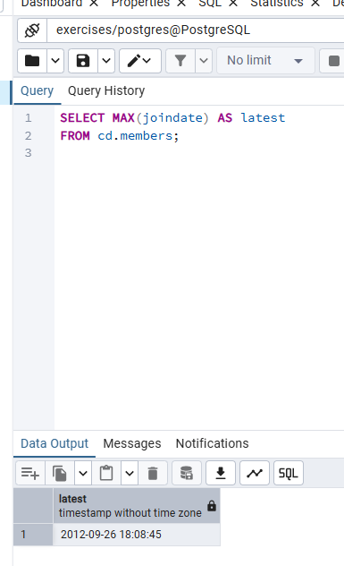

### 12. More aggregation

```sql
SELECT firstname, surname, joindate
FROM cd.members
WHERE joindate = (
    SELECT MAX(joindate)
    FROM cd.members
);
```

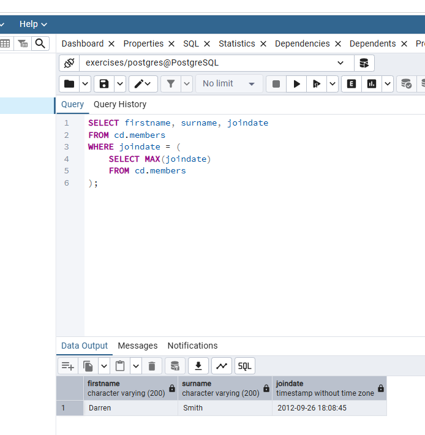

## Final Test

All queries in `cd.sql` were tested together in pgAdmin and executed successfully.

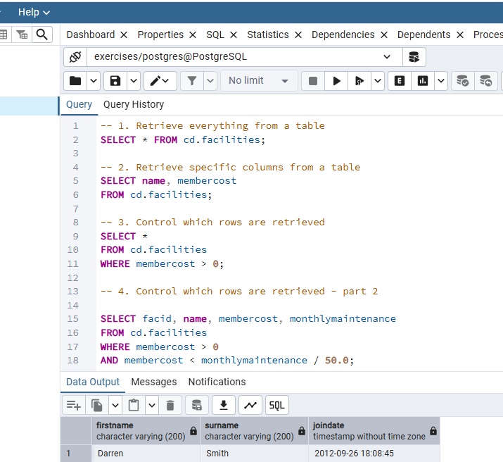

## Git Branch

This assignment was completed on the branch:

```text
week7/sqlbasics
```

## Author

**Snezana Kragujevac**

Backend Development Student  
Sundsgården Folkhögskola